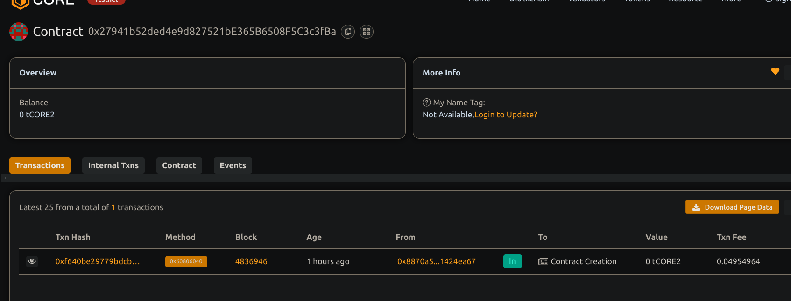

# Decentralized Exchange (DEX) with Limit Order Functionality

## Project Description
A decentralized exchange  smart contract enabling a user the create, fill, and cancel limit orders for ERC20 tokens. It provide a trustless and transparent platform for peer-to-peer token trading.

## Project Vision
To build a secure and efficient decentralized exchange that support limit orders, empowering users to trade tokens without intermediaries and with full custody control.

## Key Features
- Create limit orders specifying token pair and amounts
- Fill existing limit orders to execute trades
- Cancel orders and refund locked tokens
- Trustless escrow of tokens within contract until the order completion or cancellation
- Event logs for order lifecycle (created, filled, canceled)

## Future Scope
- Add order matching and off-chain order book for scalability
- Implement fees and incentives for market makers and takers
- Support for partial order fills
- Integration with decentralized frontends and wallets
- Advanced order types like stop-loss, market orders

## Contract details
0x27941b52ded4e9d827521bE365B6508F5C3c3fBa
